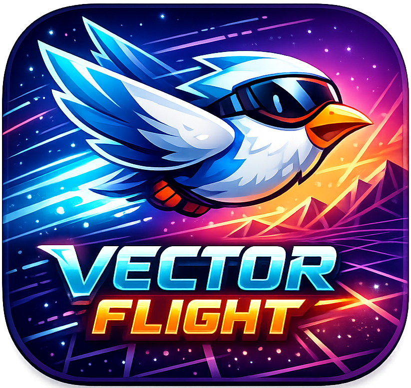
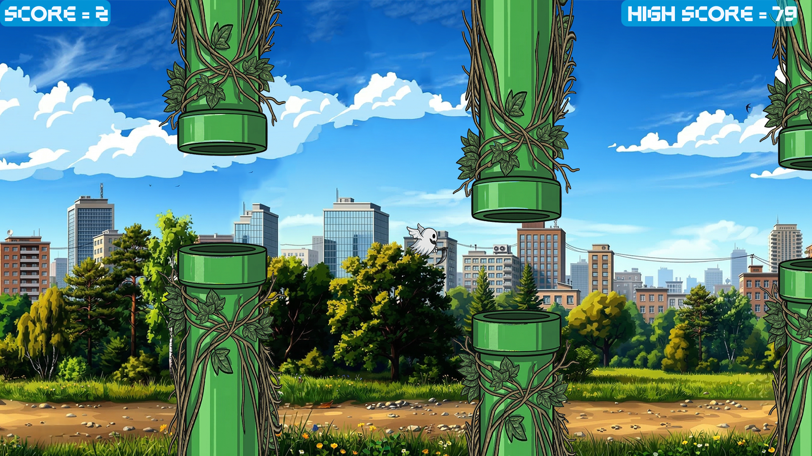
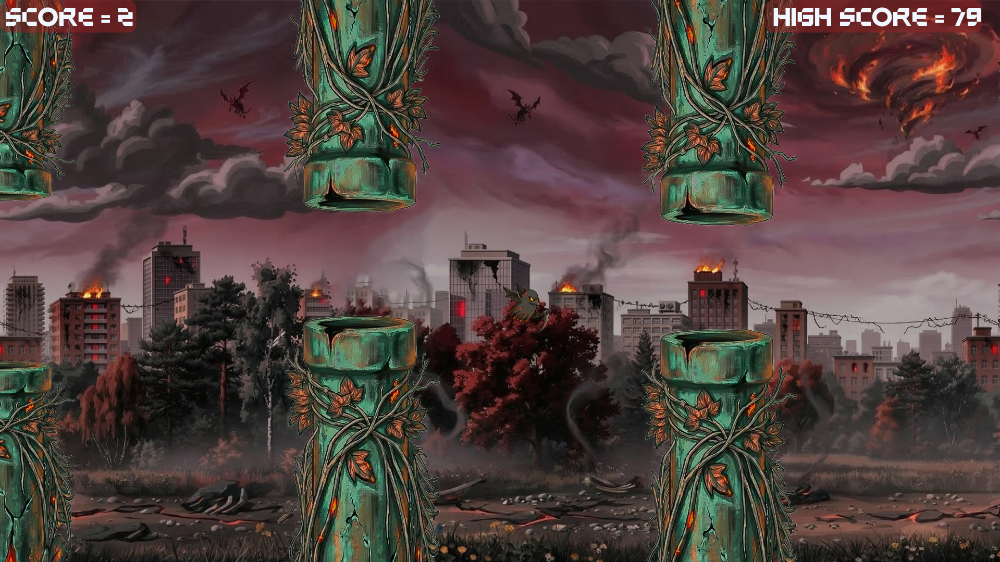

# 🚀 Vector Flight

<p align="center">
  
</p>

<p align="center">
  Fast-paced endless flyer built in pure Java featuring dual themed realms,
  persistent progression, and handcrafted UI systems.
</p>

<p align="center">
  
   
</p>

--- 
 
## 🎮 Gameplay Overview

**Vector Flight** is an arcade-style 2D obstacle-dodging game inspired by classic endless flyers.  
Navigate dangerous environments, survive increasingly difficult obstacle patterns, and push your reflexes to achieve the highest possible score.

The game features two contrasting visual realms:
 
- ☁️ **Heaven Realm** — bright, smooth, floating obstacle patterns  
- 🔥 **Hell Realm** — intense visuals with aggressive directional hazards  

Built completely using **JavaFX**, this project focuses on strong **OOP architecture**, responsive controls, and lightweight rendering performance.

---

## ✨ Key Features

- ⚡ **Standalone Executable**  
  Play instantly without installing Java or configuring runtime environments.

- 🌍 **Dual Environment System**  
  Unique sprites, obstacle logic, and atmosphere variations between realms. 

- 💾 **Persistent Save System**  
  Custom `SaveManager` handles:
  - High score tracking  
  - Player progression  

- 🎨 **Custom UI Framework**  
  Fully handcrafted menu system with animated transitions.

- 🧠 **Game State Engine**  
  Modular states implemented:
  - Main Menu  
  - Active Gameplay  
  - Pause Screen  
  - Game Over Screen  
  - Equipment Popup  

---

## ⚡ Quick Start

### ▶️ Play Instantly (Recommended)

1. Navigate to the **Releases** tab  
2. Download the latest `VectorFlight.exe`  
3. Launch the executable  
4. Start flying  

No additional setup required.

---

### 🛠️ Run From Source

#### Requirements

- JDK 8 or higher  
- Maven  
- JavaFX SDK installed and configured  

#### Build Steps

```bash
git clone https://github.com/yourusername/vector-flight.git
cd vector-flight
mvn clean install
```

Then run the **Main class** from your IDE  
or execute the generated `.jar`.

---

## 🎯 Controls

| Action | Input |
|--------|------|
| Fly Up | `Spacebar` |
| Pause Game | `ESC` |
| Menu Interaction | Mouse |

Controls can be remapped inside the event handling system.

---

## 🧱 Technical Architecture

**Tech Stack**

- Language: **Java**
- UI Framework: **JavaFX**
- Build System: **Maven**

**Engineering Concepts**

- Structured **Game Loop Management**
- Event-Driven Input Handling
- Modular **State Machine Design**
- Efficient obstacle reuse logic
- Serialized file-based persistence

---

## 📸 Screenshots

<p align="center">
  
  
</p>

---
## 🎥 Gameplay Preview

https://github.com/user-attachments/assets/0e79a3df-e131-49d8-ada3-d87b497d8a78

---

## 🗺️ Future Improvements

- New biome environments  
- Difficulty scaling system  
- Mobile control adaptation  
- Soundtrack manager  
- Performance optimization for low-end GPUs  

---

## 🤝 Contributing

Contributions are welcome.

```bash
Fork → Create Branch → Commit → Push → Pull Request
```

You may contribute by:

- Designing new obstacle patterns  
- Creating sprite packs  
- Improving physics feel  
- Optimizing rendering  

---

## 👨‍💻 Developer

**Danial Ahmed**  
Game Design • Programming • Visual Direction
